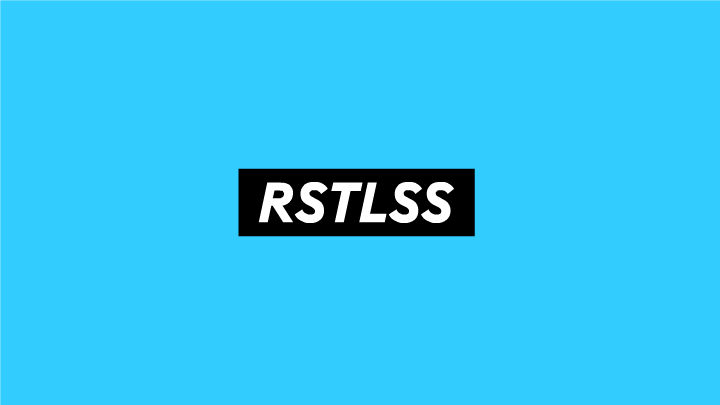

# "Navi" by RSTLSS

> Beautiful Navigation Bar + Hero Component built using React.JS

## Demo(s)

### Animation



### On the Web

- [Navi Documentation](https://navi.rstlss.org)
- [RSTLSS](https://rstlss.org)

# About & Design

`<Hero> + <Navbar> = <Navi>`

Navi is a Web Component which combines the beauty of a `<Hero>` element with the utility of a `<Navbar`.
It supports various transformations to itself and its contents on scroll.

## Features

- **Mobile-first**
- **Lightweight**
- **Reusable**
- **Customizable**
- **Versatile**:
  - the hero functionality can be toggled on/off using `props` forcing the navbar to stay in its final "collapsed" state.
    - Useful, for example, if you only want the fullscreen Hero on your index page.

# Install

using Yarn:

```
    yarn add @rstlss/Navi
```

in your project:

```jsx
  import { Navi } "@rstlss/Navi"
  import React from "react"
  import { render } from "react-dom"

  function App () {
    return <Navi>
      <h1>Navi Demo</h1>
      <p>This is the content of my Navi app, which will display directly below Navi</p>
    </Navi>
  }

  render(<App />, document.getElementById("root"))

```

# Development + Customization

## Dependencies

## Local Development (using Storybook)

To use

- Insert instructions here

## Stack + Dependencies

Navi uses the following technologies:

- Storybook
- Jest
- Yarn
- Webpack
- Typescript
- React.JS
- RxJS
- Ramda (Rambda where possible)
- Bulma

## Available Scripts

In the project directory, you can run:

### `yarn storybook`

Runs Storybook in development mode
Open [http://localhost:9001](http://localhost:9001) to view it in the browser.

### `yarn test`

Launches the test runner in the interactive watch mode.<br

### `yarn build`

Builds the app for production to the `build` folder.<br>
It correctly bundles React in production mode and optimizes the build for the best performance.

The build is minified and the filenames include the hashes.<br>
Your app is ready to be deployed!

See the section about [deployment](https://facebook.github.io/create-react-app/docs/deployment) for more information.

# License

Navi is licensed under the **Creative Commons BY NC ND 4.0** license.

If you have any problems or for any licensing enquiries please contact [Rai](mailto:rai@rbutera.com)

# Contribution

We welcome all contributions from the open source community.

For instructions and guidance please refer to [CONTRIBUTION.md](CONTRIBUTION.md)

# Credits

- Author: [Rai Butera](https://github.com/Raigasm) (of [RSTLSS](https://rstlss.org))
- Contributors:
  - you?
